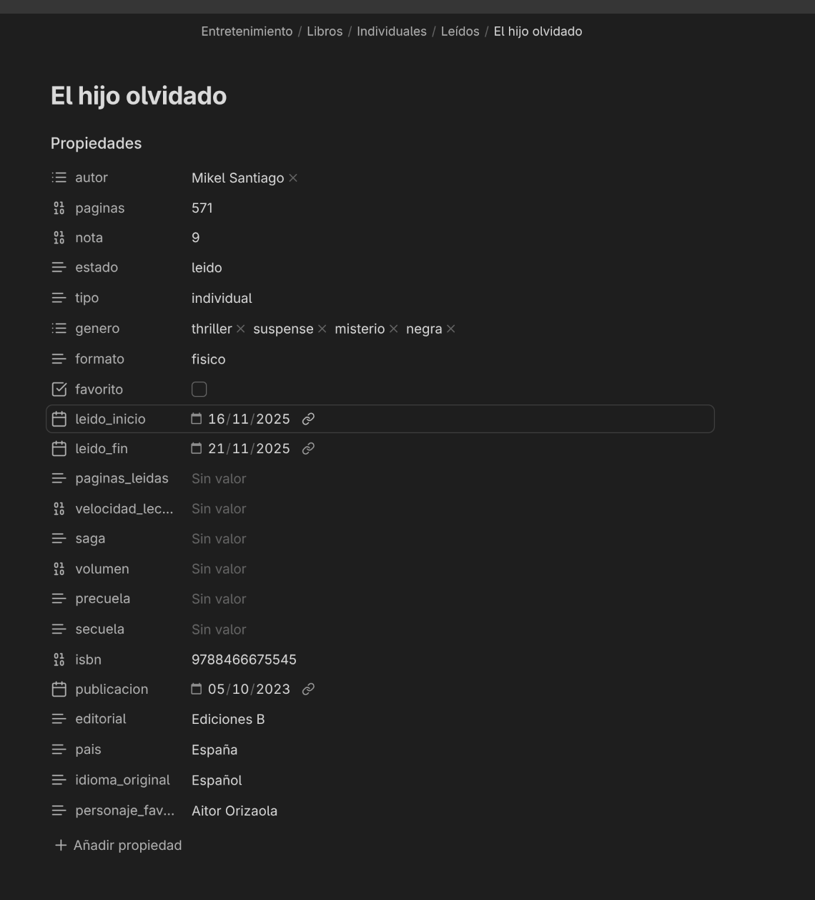

# 📚 Obsidian Reading Stats (Templater Script)

Este repositorio contiene un script avanzado para **Obsidian** diseñado para generar reportes automáticos y visuales de tu actividad lectora. Utiliza **Templater** para analizar las notas de tus libros y extraer estadísticas detalladas sobre tu ritmo de lectura, páginas devoradas y rankings personales.

## ✨ Características principales

- 📅 **Ritmo de lectura anual**: Conteo de libros leídos por año con barras de progreso visuales (ASCII).
    
- 📖 **Estadísticas de páginas**: Análisis del volumen total de páginas y desglose por año.
    
- 🏆 **Rankings automáticos**: Listado de libros por nota (calificación) y por longitud (número de páginas).
    
- 📊 **Desglose de tipos**: Diferenciación entre libros individuales, sagas y libros abandonados.
    
- 🎨 **Visualización limpia**: Uso de iconos y tablas organizadas para una lectura rápida del reporte.
    
## 🚀 Instalación

Para usar este script en tu bóveda de Obsidian, sigue estos pasos:

1. **Requisitos**: Asegúrate de tener instalado el plugin **Templater**.
    
2. **Descarga**:
    
    - Descarga el archivo `stats-obsidian.md` de este repositorio.
        
    - Cópialo en tu carpeta de plantillas de Obsidian.
        
3. **Configuración del Frontmatter**: El script busca las siguientes propiedades YAML en tus notas de libros:
    
    - `estado`: (ej: leido, abandonado)
        
    - `leido_fin`: Fecha en formato AAAA-MM-DD.
        
    - `paginas`: Número total de páginas.
        
    - `nota`: Tu calificación (0-10).
        
    - `tipo`: (ej: individual, saga)

    [📄 Ver Plantilla YAML](assets/templates/YAML-Template.md)

    ### Visualización de archivo con formato YAML:

    
        

## 📂 Archivos en este repositorio

- `src/stats.js`: El código fuente en JavaScript puro. Ideal para desarrolladores que quieran revisar la lógica o aplicar resaltado de sintaxis en editores externos.
    
- `stats-obsidian.md`: El archivo listo para usar en Obsidian. Contiene el código envuelto en las etiquetas de Templater (`<%* ... %>`).
    

## 🛠️ Uso

1. Crea una nota nueva en Obsidian (ej: `Estadísticas de libros`).
    
2. Ejecuta el comando de Templater: `Templater: Insert template`.
    
3. Selecciona esta plantilla y ¡listo! El reporte se generará automáticamente analizando todos los archivos en la ruta configurada.

IMPORTANTE: se debe configurar la ruta en la que se buscarán archivos con formato YAML manualmente desde el archivo .md que se vaya a ejecutar en Obsidian (Por defecto: Entretenimiento/Libros).

## Ejemplo de visualización

| **Año**  | **Progreso Visual** | **Cantidad** |
| -------- | ------------------- | ------------ |
| **2025** | ▓▓▓▓▓▓▓▓▓▓          | **19**       |
| **2024** | ▓▓▓▓▓░░░░░          | **10**       |

## 📝 Notas del autor

Este script ha sido diseñado para ser ligero y funcional, priorizando la visualización de datos dentro de un entorno de texto plano como es Obsidian.